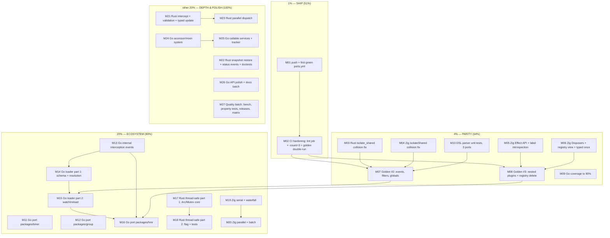

# SHIP → PARITY → ECOSYSTEM — Pareto Execution Plan

**Date:** 2026-09-04 15:42 CEST
**Source of truth:** `TODO_LIST.md` (post-session harvest) + status report
`docs/status/2026-09-04_15-34_phase2-native-max-api-landed.md` §(f).
**Baseline:** commit `40f46e4` — phase-2 native-max API landed; Go 86.5%
coverage, golangci-lint clean, clippy clean, Zig 17/17, `nix flake check`
green, golden scenario byte-identical across Go/Rust/Zig.
**Customer:** Lars (owner) + future users of the ports.
**Definition of "the result":** a trustworthy multi-language cordis fork —
CI-proven, parity-machine-checked, with a Go ecosystem (timer, loader,
hmr) that makes it a framework rather than a demo.

> Format note: written as `.md` with an embedded **mermaid.js** execution
> graph per explicit user instruction (skill default is a styled HTML
> report; the user's instruction wins).

---

## 1. Pareto Breakdown

### The 1% that delivers 51% — SHIP WHAT EXISTS

Everything from the phase-2 session is _claimed_ done but **remotely
unproven**: nothing has ever run on GitHub Actions. Until the first green
`ports.yml` run exists, 100% of the session work is unverifiable by
anyone but this machine. Four tiny tasks (push, watch the run, lint job,
flake canary) convert every existing claim into evidence.

1. Push `main` → first `ports.yml` execution → record the green run URL.
2. Add `golangci-lint` job + `go test -count=3` flake canary to CI.

**Effort:** ~60 min. **Value:** everything already built becomes proven.

### The 4% that delivers 64% (cumulative) — CLOSE THE PARITY HOLES

The ports are _almost_ interchangeable. Three real gaps remain:

1. **A known bug class in two ports**: Rust `isolate_shared` and Zig
   `isolateShared` still build `"{name}\0{label}"` synthetic keys — the
   exact collision Go just fixed. Small, real, embarrassing if shipped.
2. **Golden coverage stops at lifecycle**: no machine-checked parity for
   events, filters, nested-plugin cascades, registry delete.
3. **Zig is not yet usable as a port**: no `Effect` API, no Disposers, no
   registry view — Go/Rust parity blockers.
4. **Go flagship coverage 86.5%**: the uncovered 13.5% is exactly the
   panic/recover plumbing you want covered in a framework.

**Effort:** ~9h. **Value:** "three interchangeable ports" becomes a
machine-enforced fact instead of a README claim.

### The 20% that delivers 80% (cumulative) — MAKE GO A FRAMEWORK

A DI runtime without an ecosystem is a demo. Upstream cordis ships
`timer`, `group`, `loader`, `hmr`. Porting them (plus the interception
events they need) is what makes someone _choose_ this framework. In
parallel, the Rust thread-safe variant unlocks real Rust users (the
tokio world is threaded; a single-threaded-only crate is a toy there),
and Zig's missing dispatch modes complete its event story.

**Effort:** ~2–3 days. **Value:** the fork becomes usable for real
applications in all three languages.

### The other 20% (to reach 100%) — DEPTH & POLISH

Accessor/mixin system, callable services + tracker attribution, Rust
intercept/validation/status events/parallel dispatch/snapshot restore,
Zig batch, Go API polish (`Fiber.Err`, `Await(ctx)`, `errors.AsType`,
typed-inject sugar), documentation depth (API comparison table, badges,
Zig std gotchas, Batch semantics), and quality extras (benchmarks, LIFO
property test, parity matrix generation, releases/tags, flake-check CI
job, `zig build -femit-docs`, stale-LSP sweep, run cadence).

---

## 2. Execution Graph

**Dependency logic:** CI must be green before anything else is verifiable
remotely. Golden #2/#3 need the isolate fixes (realms appear in event
scenarios) and the DSL parser tests (robust runners). Loader/hmr need the
interception events; hmr needs loader + the cascade golden. The Rust
thread-safe variant is independent. Everything in tier 4 is independent
of tier 3 except where noted.

---

## 3. Comprehensive Plan — Medium Granularity (30–100 min tasks)

Sorted by importance / impact / effort / customer-value. Tier: P1 = the
1%, P4 = the 4%, P20 = the 20%, P100 = the other 20%.

| ID  | Task                                                                                                                                                                                                      | Tier | Impact   | Effort                                                  | Customer value                                         |
| --- | --------------------------------------------------------------------------------------------------------------------------------------------------------------------------------------------------------- | ---- | -------- | ------------------------------------------------------- | ------------------------------------------------------ |
| M01 | Push `main`, watch the first `ports.yml` run, record the green URL in TODO_LIST                                                                                                                           | P1   | Critical | 30m                                                     | All session work becomes remotely proven               |
| M02 | CI hardening: `golangci-lint` job, `go test -count=3`, golden double-run canary, actionlint re-verify                                                                                                     | P1   | High     | 30m                                                     | No silent lint regressions; flake canary               |
| M03 | Rust `isolate_shared` collision-free labels (tuple-keyed table like Go) + collision tests                                                                                                                 | P4   | High     | 30m                                                     | Kills the known bug class in Rust                      |
| M04 | Zig `isolateShared` collision-free labels + collision tests                                                                                                                                               | P4   | High     | 30m                                                     | Kills the known bug class in Zig                       |
| M05 | Zig `Context.effect` nested-scope API + effect-label introspection (`EffectMeta` trees)                                                                                                                   | P4   | High     | 90m                                                     | Zig reaches Go/Rust effect parity                      |
| M06 | Zig Disposer handles for `on`/`provide` + registry view (size/has/delete) + typed `once`                                                                                                                  | P4   | High     | 90m                                                     | Zig becomes usable as a port                           |
| M07 | Golden scenario #2: typed/string events, filters, global listeners — three runners, byte-identical                                                                                                        | P4   | High     | 60m                                                     | Event parity machine-enforced                          |
| M08 | Golden scenario #3: nested plugins + registry delete cascade — three runners                                                                                                                              | P4   | Medium   | 60m                                                     | Cascade parity machine-enforced                        |
| M09 | Go coverage → ≥90% (Waterfall panic guards, Parallel recover, slog edges, failed-load stdctx)                                                                                                             | P4   | Medium   | 90m                                                     | Trust in the flagship's error paths                    |
| M10 | DSL parser unit tests for all three golden runners (malformed tokens, param edge cases)                                                                                                                   | P4   | Medium   | 30m                                                     | Golden runners stop being triplicated hand-rolled risk |
| M11 | Go port `packages/timer` (interval/timeout effects on `Fiber.StdContext`)                                                                                                                                 | P20  | Medium   | 30m                                                     | First ecosystem package                                |
| M12 | Go port `packages/group` (join/leave with registry semantics)                                                                                                                                             | P20  | Medium   | 30m                                                     | Ecosystem package                                      |
| M13 | Go `internal/get                                                                                                                                                                                          | set  | listener | dispatch` interception events (loader/hmr prerequisite) | P20                                                    |
| M14 | Go loader part 1: config schema, file discovery, plugin resolution, validation, start pipeline                                                                                                            | P20  | High     | 100m                                                    | Config-driven plugin management                        |
| M15 | Go loader part 2: watch/reload diffing, interception reactions, rollback tests                                                                                                                            | P20  | High     | 100m                                                    | Live reload on config change                           |
| M16 | Go port `packages/hmr` (module identity, accept/decline, dispose+relink, TS fixtures)                                                                                                                     | P20  | High     | 100m                                                    | The killer upstream feature                            |
| M17 | Rust thread-safe variant part 1: `Arc`/`Mutex` core, lock-free user callbacks preserved                                                                                                                   | P20  | High     | 100m                                                    | Unlocks real (threaded) Rust usage                     |
| M18 | Rust thread-safe variant part 2: feature-flag wiring, stress tests, clippy                                                                                                                                | P20  | High     | 60m                                                     | Ship the variant safely                                |
| M19 | Zig `serial` + `waterfall` dispatch modes + tests                                                                                                                                                         | P20  | Medium   | 90m                                                     | Event story completion                                 |
| M20 | Zig `parallel` dispatch (error joining) + `batch` transactions + tests                                                                                                                                    | P20  | Medium   | 90m                                                     | Event + transaction story completion                   |
| M21 | Rust `intercept`/`Intercepted` + config validation hook + typed `update`                                                                                                                                  | P100 | Medium   | 90m                                                     | Go-parity scope configuration                          |
| M22 | Rust registry snapshot restore + `internal/status` event emission + typed doctests                                                                                                                        | P100 | Medium   | 90m                                                     | Tooling parity + docs                                  |
| M23 | Rust true parallel dispatch with scoped threads                                                                                                                                                           | P100 | Medium   | 60m                                                     | Performance parity with Go `Parallel`                  |
| M24 | Go accessor/mixin service system (Property.Accessor upstream)                                                                                                                                             | P100 | Medium   | 100m                                                    | Advanced service patterns                              |
| M25 | Go callable services + tracker-based effect attribution                                                                                                                                                   | P100 | Medium   | 100m                                                    | Effects created via services attributed to callers     |
| M26 | Go API polish + docs batch: `Fiber.Err()`, `Await(ctx)`, `errors.AsType`, typed-inject sugar, PORTS API table, README badges, AGENTS Zig gotchas, Batch semantics + upstream notes                        | P100 | Medium   | 90m                                                     | Ergonomics + documentation depth                       |
| M27 | Quality batch: flake-check CI job, benchmark skeletons (Go first), LIFO rollback property test, releases/tags, `zig build -femit-docs`, stale-LSP/AsType sweep, run cadence note, parity-matrix generator | P100 | Low      | 100m                                                    | Long-term health                                       |

**Totals:** 27 tasks, ~26.5 h. ALL open TODO items are covered (verified
against `TODO_LIST.md` sections Go / Go follow-ups / Rust / Zig / Golden
tests / Repo).

---

## 4. Detailed Breakdown — Fine Granularity (≤12 min per task)

Sorted within each tier by importance/impact/effort. IDs `F<medium>.<n>`
reference the medium task above.

### Tier P1 — SHIP (10 tasks)

| ID    | Task                                                                     | Est | Depends on   |
| ----- | ------------------------------------------------------------------------ | --- | ------------ |
| F01.1 | `git push origin main`; confirm push accepted                            | 2m  | —            |
| F01.2 | Open/watch the `Ports` workflow run for the new commit (all three jobs)  | 10m | F01.1        |
| F01.3 | Record the green run URL + commit SHA in TODO_LIST (`Repo` section)      | 2m  | F01.2        |
| F01.4 | If red: triage, fix locally, amend workflow, re-push (iterate)           | 12m | F01.2        |
| F02.1 | Add `golangci-lint` job to `ports.yml` (v2 config, `timeout-minutes: 5`) | 12m | —            |
| F02.2 | Change Go test step to `go test -race -count=3 ./...` (flake canary)     | 2m  | —            |
| F02.3 | Run golden test twice in the Go job (`-run TestGoldenScenario -count=2`) | 5m  | —            |
| F02.4 | Lint updated workflows with `nix run nixpkgs#actionlint`                 | 2m  | F02.1–3      |
| F02.5 | Verify locally: exact CI commands green                                  | 10m | F02.1–3      |
| F02.6 | Push and confirm the hardened workflow is green; record URL              | 5m  | F02.4, F02.5 |

### Tier P4 — PARITY (41 tasks)

| ID    | Task                                                                                   | Est | Depends on   |
| ----- | -------------------------------------------------------------------------------------- | --- | ------------ |
| F03.1 | Rust `Core`: add `labels: HashMap<(String, String), IsolateKey>` table                 | 10m | —            |
| F03.2 | `isolate_shared` resolves through the label table (no `format!` synthetic key)         | 10m | F03.1        |
| F03.3 | Collision test: `("a\0b","c")` vs `("a","b\0c")` distinct realms                       | 10m | F03.2        |
| F03.4 | Shared-label regression test (existing behavior preserved)                             | 5m  | F03.2        |
| F03.5 | `cargo clippy --deny warnings && cargo test` green                                     | 5m  | F03.3        |
| F04.1 | Zig `Core`: label table keyed by `struct { name, label }`                              | 10m | —            |
| F04.2 | `isolateShared` resolves through the table                                             | 10m | F04.1        |
| F04.3 | Collision + shared-label tests                                                         | 10m | F04.2        |
| F04.4 | `zig build test` green                                                                 | 5m  | F04.3        |
| F05.1 | Zig `Context.effect(label, data, f)` signature + collect-bag wiring                    | 12m | —            |
| F05.2 | Effect rollback path: dispose child bag LIFO on error/panic                            | 12m | F05.1        |
| F05.3 | `EffectMeta` tree struct + `Fiber.effects()` introspection                             | 12m | F05.1        |
| F05.4 | `currentBag` integration (collect vs fiber bag)                                        | 10m | F05.1        |
| F05.5 | Tests: nested LIFO rollback order                                                      | 10m | F05.2        |
| F05.6 | Tests: effect error rolls back partial registrations                                   | 10m | F05.2        |
| F05.7 | Tests: introspection tree shape                                                        | 10m | F05.3        |
| F05.8 | `zig build test` + golden still green                                                  | 5m  | F05.5–7      |
| F06.1 | Zig `on`/`provide` return Disposer handles (idempotent dispose)                        | 12m | —            |
| F06.2 | Disposer semantics: detach-from-bag without execution path                             | 12m | F06.1        |
| F06.3 | Registry view: `size`/`has`/`delete` over the runtimes map                             | 12m | —            |
| F06.4 | Typed `once` for events                                                                | 10m | —            |
| F06.5 | Tests: Disposer idempotency + early removal                                            | 10m | F06.2        |
| F06.6 | Tests: registry delete restores pre-start state                                        | 10m | F06.3        |
| F06.7 | Tests: typed `once` fires exactly once                                                 | 8m  | F06.4        |
| F06.8 | `zig build test` green                                                                 | 5m  | F06.5–7      |
| F07.1 | Write `golden/scenario-events.txt` (typed emit, prepend order, filters, global bypass) | 12m | M03, M04     |
| F07.2 | Extend the DSL: `on-event`, `emit`, `emit-filtered` ops (spec + all runners)           | 12m | F07.1        |
| F07.3 | Go runner: new ops + regenerate expected-events                                        | 12m | F07.2        |
| F07.4 | Rust runner: new ops, verify byte-identical trace                                      | 12m | F07.3        |
| F07.5 | Zig runner: new ops, verify byte-identical trace                                       | 12m | F07.3        |
| F07.6 | All three suites green; commit golden pair                                             | 5m  | F07.4, F07.5 |
| F08.1 | Write `golden/scenario-registry.txt` (nested starts, registry delete, cascade)         | 12m | M05, M06     |
| F08.2 | DSL ops: `registry-delete`, `expect-registry-size` (spec + runners)                    | 12m | F08.1        |
| F08.3 | Go runner + regenerate expected                                                        | 12m | F08.2        |
| F08.4 | Rust runner (needs F22 snapshot-free `delete_id` — already present)                    | 10m | F08.3        |
| F08.5 | Zig runner (uses F06.3 registry view)                                                  | 12m | F08.3        |
| F08.6 | All three green; commit                                                                | 5m  | F08.4, F08.5 |
| F09.1 | `go test -coverprofile` → list uncovered functions, pick targets                       | 5m  | —            |
| F09.2 | Tests: `Waterfall` panic guards (missing terminal, wrong type)                         | 12m | F09.1        |
| F09.3 | Tests: `Parallel` recover path + error aggregation                                     | 12m | F09.1        |
| F09.4 | Tests: slog edges (zero attrs, group-in-group, empty group key)                        | 12m | F09.1        |
| F09.5 | Tests: failed-load stdctx cancellation + `Once` fire-between-register race             | 12m | F09.1        |
| F09.6 | Verify ≥90%; commit                                                                    | 5m  | F09.2–5      |
| F10.1 | Go: extract DSL parse into `parseGoldenOp` + table-driven test                         | 12m | —            |
| F10.2 | Rust: unit tests for `parse_params` (deps/realm/config/lifo/malformed)                 | 12m | —            |
| F10.3 | Zig: unit tests for `parseParams`                                                      | 12m | —            |
| F10.4 | All suites green; commit                                                               | 5m  | F10.1–3      |

### Tier P20 — ECOSYSTEM (38 tasks)

| ID    | Task                                                                     | Est | Depends on   |
| ----- | ------------------------------------------------------------------------ | --- | ------------ |
| F11.1 | Go `timer` package: `Interval(ctx, d, fn)` effect on `Fiber.StdContext`  | 12m | —            |
| F11.2 | `Timeout` + `Idle` variants                                              | 12m | F11.1        |
| F11.3 | Tests: cancel-on-unload, tick count, timeout firing                      | 12m | F11.2        |
| F11.4 | README section + race test                                               | 8m  | F11.3        |
| F12.1 | Go `group` package: `Join(ctx, handle, config)` registry semantics       | 12m | —            |
| F12.2 | `Leave` + group-as-plugin composition                                    | 12m | F12.1        |
| F12.3 | Tests: join/leave lifecycle, registry restore                            | 12m | F12.2        |
| F12.4 | Docs; suite green                                                        | 5m  | F12.3        |
| F13.1 | Define `internal/get                                                     | set | listener     |
| F13.2 | Emit `get`/`set` around provide/lookup (realm-filtered)                  | 12m | F13.1        |
| F13.3 | Emit `listener`/`dispatch` around on/emit/parallel/serial/waterfall      | 12m | F13.1        |
| F13.4 | Loader-shaped tests: interception can veto/rewrite a provide             | 12m | F13.2        |
| F13.5 | Loader-shaped tests: interception can observe/suppress dispatch          | 12m | F13.3        |
| F13.6 | Regression: full suite + golden unchanged (events are opt-in observable) | 8m  | F13.5        |
| F13.7 | Docs: interception contract in DOMAIN_LANGUAGE + README                  | 8m  | F13.6        |
| F14.1 | Loader config schema types (entries, configs, deps) mirroring upstream   | 12m | M13          |
| F14.2 | File discovery + JSON/YAML decode (config file → entries)                | 12m | F14.1        |
| F14.3 | Plugin resolution: entries → `NewPlugin` wiring + validation             | 12m | F14.2        |
| F14.4 | Start pipeline: dependency-ordered Start with inject wiring              | 12m | F14.3        |
| F14.5 | Tests: full-tree start from a config file (fixtures)                     | 12m | F14.4        |
| F14.6 | Tests: validation errors surface per entry                               | 12m | F14.4        |
| F14.7 | Docs + commit                                                            | 5m  | F14.6        |
| F15.1 | fsnotify-based watch abstraction behind an interface                     | 12m | M14          |
| F15.2 | Reload diffing: added/removed/changed entries via `Update`/`Dispose`     | 12m | F15.1        |
| F15.3 | Interception reactions wired (`internal/set` veto, reload hooks)         | 12m | F15.2        |
| F15.4 | Tests: config change reloads in place (state preserved)                  | 12m | F15.3        |
| F15.5 | Tests: entry removal rolls back exactly that subtree                     | 12m | F15.2        |
| F15.6 | Race test for concurrent reload + docs                                   | 12m | F15.5        |
| F16.1 | hmr module identity model (key, dispose+relink contract)                 | 12m | M15          |
| F16.2 | `Accept`/`Decline` API on the hmr context                                | 12m | F16.1        |
| F16.3 | Dispose + relink pipeline through interception events                    | 12m | F16.2        |
| F16.4 | Tests: module swap preserves unaffected siblings                         | 12m | F16.3        |
| F16.5 | Tests: declined update keeps old module live                             | 12m | F16.3        |
| F16.6 | Port TS hmr fixtures; parity-style assertions                            | 12m | F16.5        |
| F16.7 | Docs + suite green + commit                                              | 5m  | F16.6        |
| F17.1 | Rust: `Core` → `Arc<Mutex<..>>` type shim behind `cfg(feature)`          | 12m | —            |
| F17.2 | hooks/store/runtimes accessors through the lock discipline               | 12m | F17.1        |
| F17.3 | `enter`/`leave` drain under the mutex (no lock held in user calls)       | 12m | F17.2        |
| F17.4 | Fiber arena/handles made Send+Sync safe (or documented !Send boundary)   | 12m | F17.3        |
| F17.5 | Port the parity suite subset against the threaded core                   | 12m | F17.4        |
| F17.6 | Compile default (single-thread) feature unchanged                        | 5m  | F17.5        |
| F18.1 | `Cargo.toml` feature flag + cfg gates audit                              | 10m | M17          |
| F18.2 | Stress test: concurrent start/provide/emit hammering                     | 12m | F18.1        |
| F18.3 | Stress test: concurrent dispose vs drain                                 | 12m | F18.1        |
| F18.4 | clippy + full matrix (`--all-features`) + docs + commit                  | 8m  | F18.2, F18.3 |

### Tier P20b — ECOSYSTEM, Zig modes (14 tasks)

| ID    | Task                                                    | Est | Depends on   |
| ----- | ------------------------------------------------------- | --- | ------------ |
| F19.1 | Zig `serial` (first non-null result) + bail alias       | 12m | —            |
| F19.2 | Tests: serial short-circuit order                       | 10m | F19.1        |
| F19.3 | Zig `waterfall` (next-continuation composition)         | 12m | F19.1        |
| F19.4 | Tests: waterfall compose + short-circuit                | 12m | F19.3        |
| F19.5 | Docs + suite green                                      | 5m  | F19.4        |
| F20.1 | Zig `parallel` (error joining, panic-safe)              | 12m | —            |
| F20.2 | Tests: parallel error aggregation                       | 10m | F20.1        |
| F20.3 | Zig `batch` transactions (enter/leave reuse)            | 12m | —            |
| F20.4 | Tests: batch coalescing (single settle, no torn states) | 12m | F20.3        |
| F20.5 | `zig build test` + golden green + docs                  | 5m  | F20.2, F20.4 |

### Tier P100 — DEPTH & POLISH (47 tasks)

| ID    | Task                                                                                 | Est | Depends on   |
| ----- | ------------------------------------------------------------------------------------ | --- | ------------ |
| F21.1 | Rust `Context::intercept` + `intercepted` (scope chain walk)                         | 12m | —            |
| F21.2 | Config validation hook on the Plugin trait (default no-op)                           | 10m | —            |
| F21.3 | Typed `update` on trait plugins (avoid raw `Value`)                                  | 12m | F21.2        |
| F21.4 | Tests: intercept visibility + validation rejection                                   | 12m | F21.1, F21.2 |
| F21.5 | Docs + clippy + commit                                                               | 5m  | F21.4        |
| F22.1 | Rust registry snapshot struct (runtimes + fibers view)                               | 12m | —            |
| F22.2 | `restore` semantics (dispose delta, re-start missing)                                | 12m | F22.1        |
| F22.3 | Emit `internal/status`-equivalent on transitions                                     | 12m | —            |
| F22.4 | Tests: snapshot restore == pre-state                                                 | 12m | F22.2        |
| F22.5 | Tests: status emission order                                                         | 10m | F22.3        |
| F22.6 | Doctests: typed services, typed events, `get_named`                                  | 12m | —            |
| F22.7 | Doctests: `start`/`start_fn` registry identity                                       | 10m | F22.6        |
| F23.1 | Rust parallel dispatch with scoped threads                                           | 12m | M21          |
| F23.2 | Tests: concurrent listeners, joined errors                                           | 12m | F23.1        |
| F23.3 | clippy + commit                                                                      | 5m  | F23.2        |
| F24.1 | Go accessor prop type + accessor store next to the service store                     | 12m | —            |
| F24.2 | Mixin registration API on Context                                                    | 12m | F24.1        |
| F24.3 | Get/set routing through accessors when declared                                      | 12m | F24.2        |
| F24.4 | Tests: accessor shadowing + realm interaction                                        | 12m | F24.3        |
| F24.5 | Introspection + docs                                                                 | 12m | F24.4        |
| F25.1 | Go callable service type (services that are funcs)                                   | 12m | —            |
| F25.2 | Tracker context: current calling fiber during service ops                            | 12m | F25.1        |
| F25.3 | Attribution wiring in registration paths                                             | 12m | F25.2        |
| F25.4 | Tests: effects created via service attribute to caller                               | 12m | F25.3        |
| F25.5 | Tests: effect tree shape under attribution + docs                                    | 12m | F25.4        |
| F26.1 | Go `Fiber.Err()` accessor (apply error)                                              | 5m  | —            |
| F26.2 | Go `Await` variant honoring a `context.Context`/timeout                              | 12m | —            |
| F26.3 | Migrate `errors.As` → `errors.AsType[*Error]` in `errors.go`                         | 8m  | —            |
| F26.4 | Typed-inject sugar: `Plugin.InjectTypes[T1, T2]()`                                   | 12m | —            |
| F26.5 | PORTS.md cross-port API comparison table                                             | 12m | —            |
| F26.6 | Root README badges + port pitch paragraph                                            | 10m | —            |
| F26.7 | AGENTS.md Zig 0.16 std gotchas (Io.Dir.cwd, ArrayList .empty, WriteFiles+@embedFile) | 10m | —            |
| F26.8 | Batch semantics + upstream deterministic-order notes; vet/lint/test green            | 12m | F26.1–4      |
| F27.1 | CI job running `nix flake check -L`                                                  | 10m | —            |
| F27.2 | Go benchmark skeleton: drain-queue throughput (testing.B)                            | 12m | —            |
| F27.3 | Rust + Zig benchmark stubs + README results table skeleton                           | 10m | F27.2        |
| F27.4 | LIFO rollback property test (Go, randomized registration sequences)                  | 12m | —            |
| F27.5 | Releases: tag `go/v0.1.0`, bump+tag Rust `v0.2.0`, Zig version note                  | 12m | —            |
| F27.6 | `zig build -femit-docs` pass; fix broken doc comments                                | 12m | —            |
| F27.7 | Stale-LSP/AsType sweep verification (builds clean)                                   | 5m  | —            |
| F27.8 | Parity-matrix generator from FEATURES.md + weekly run cadence note                   | 12m | —            |

**Fine totals:** 10 + 41 + 38 + 14 + 47 = **150 tasks**, every one ≤12 min.
ALL TODO items are covered; no TODO exists outside this plan.

---

## 5. Sequencing summary

1. **Today (P1):** M01 + M02 — ship and harden CI. Nothing else matters
   until the run is green remotely.
2. **This week (P4):** M03–M10 in dependency order (isolate fixes →
   Zig effect/disposers → goldens → coverage → parser tests).
3. **Next (P20):** M11–M20 — timer/group quick wins, then interception
   events → loader → hmr on the Go side; Rust thread-safe and Zig modes
   in parallel.
4. **Background (P100):** M21–M27 whenever blocked or waiting on reviews.

## 6. Anti-Verschlimmbesserung rules for execution

- Fix the port, never the golden file (regenerate only on intentional
  scenario change, then verify all three runners).
- No API renames without updating every consumer + docs + AGENTS.md.
- Race suites are only green at `-count≥3`.
- Never push to `upstream`; `origin` only.
- Don't refactor unrelated code inside feature tasks.

---

_Point-in-time plan. Re-verify claims against the repo before executing.
Generated 2026-09-04 15:42 CEST._
