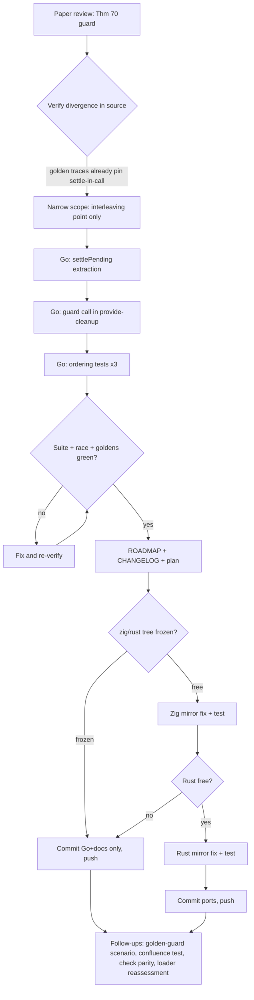

# Unload-Guard Parity — Closing the Teardown-Ordering Divergence (Paper Thm 70)

Session: 2026-09-10 07:55 · Branch: main
Trigger: paper review of arXiv 2608.25512 ("A Programming Paradigm for Spatiotemporal
Composability", the formalization of cordis) exposed a class of divergence between the
TS reference and all three ports in **dependent-teardown ordering**.

## 1. Root cause (READ/UNDERSTAND/RESEARCH — verified against source)

The paper's **L-Unload guard** (Section 4.2.2, Theorem 70) and TS's provide-disposer
(`packages/core/src/reflect.ts:201-209`) settle a provider's dependents **at the point
of withdrawal**, before the provider's _remaining_ disposer chain continues:

```ts
return async () => {
  delete this.store[key]                                   // withdrawal visible
  const fibers = this.notify([name])                       // dependents start unloading
  await Promise.allSettled(fibers.map(f => f.await()))     // ← THE GUARD
  delete this.ctx.fiber.store![name]                       // "self access before deps cleanup"
}
```

Ports today (Go `go/reflect.go:43-50`, Rust `rust/src/service.rs:106-111`,
Zig `zig/src/cordis.zig` provideNamed removal closure): `delete store → notify
(queue) → return`. Because every cleanup runs inside `enter/leave` and `leave()`
refuses to drain while `draining == true` (Go `go/core.go:117-137`,
Zig `Core.leave`), the notified dependents settle only at the **next outer drain
boundary** — i.e. after the provider's entire remaining LIFO bag has already run.

### What already works (do not "fix" what is not broken)

- Dependent settle _within the withdrawing API call_: `fiber.Dispose()` /
  direct-disposer withdrawal settles all dependents before returning. The golden
  traces pin this (`golden/expected.txt`: `cleanup consumer`, `cleanup watcher`
  precede `withdrawn config`). **Verified: unchanged by this fix.**
- Direct top-level disposer call (`depth==0`): `runCleanup`'s enter/leave already
  drains dependents inside the call.

### What is broken (the observable divergence)

The **interleaving point** inside the provider's own teardown. Canonical idiom:

```go
ctx.Effect(func() (err error) {
    pool := createPool()
    d, _ := ctx.Provide("db", pool)
    return func() { d(); pool.destroy() }   // dependents must drain between these
})
```

TS: dependents hand their handles back **between** `d()` and `pool.destroy()`.
Ports: `pool.destroy()` runs first, dependents unload later against a destroyed
pool. This is Theorem 70(2) ("provider's episode closes after the consumer's")
violated at the effect level.

## 2. Pareto decomposition

| Tier                 | Deliverable                                                                                                                                               | Why it dominates                                                                                                       |
| -------------------- | --------------------------------------------------------------------------------------------------------------------------------------------------------- | ---------------------------------------------------------------------------------------------------------------------- |
| **1% → 51%**         | Go guard fix (`settlePending` at the provide-cleanup point) + ordering tests                                                                              | Go is the flagship/reference port; the semantics, test shape and doc language every other port copies are decided here |
| **4% → 64%**         | Zig mirror fix + parity test; ROADMAP/CHANGELOG divergence entry                                                                                          | 2 of 3 ports semantically aligned with TS + paper; divergence class documented so it cannot silently regress           |
| **20% → 80%**        | Rust mirror fix + parity test; new cross-language golden scenario `scenario-guard.txt`; confluence test (Thm 80)                                          | Full three-port parity, machine-pinned cross-language, plus the next-biggest untested theorem                          |
| **other 80% → 100%** | Long-tail backlog below (check() parity, interception events, Zig gaps, loader realm-migration, rc.10 loader reassessment, logger golden, coverage gates) | Real but bounded; none block the semantic alignment                                                                    |

## 3. The fix (identical shape in every port)

Extract the drain loop of `leave()` into `settlePending()` and call it from the
provide-cleanup **after** `notifyDependents` + service event emission:

```go
// core.go
func (c *core) settlePending() {
    for {
        c.mu.Lock()
        if len(c.dirty) == 0 { c.mu.Unlock(); return }
        f := c.dirty[0]; c.dirty = c.dirty[1:]; f.queued = false
        c.mu.Unlock()
        f.transition()
    }
}
// leave() becomes: draining = true; settlePending(); draining = false
// reflect.go provide cleanup: ... notifyDependents; emitService; co.settlePending()
```

Safety analysis:

- **Reentrancy**: settlePending runs on the cleanup's goroutine with no locks
  held; nested withdrawal (dependent's own provide-cleanup) recurses to
  dependency-tree depth — same logical nesting TS spreads over the event loop.
- **Termination**: identical loop to the existing `leave()` drain, which already
  must terminate on cascades; cycles cannot activate (mutual deps stay Pending).
- **`executing` fibers popped mid-transition**: early-return in `transition()`
  is pre-existing behavior of the outer loop; not a new hazard.
- **Golden bytes**: dependents settle earlier but _within the same API call_;
  per-fiber order (uid-sorted queue) preserved → traces unchanged (verify
  empirically, both Go goldens + loader watch-golden).

## 4. Task plan — Level 1 (30–100 min each)

| #     | Task                                                                                      | Port      | Impact   | Effort | Status gate                                   |
| ----- | ----------------------------------------------------------------------------------------- | --------- | -------- | ------ | --------------------------------------------- |
| L1.1  | Guard fix in Go (`settlePending` + provide-cleanup call)                                  | Go        | critical | 45m    | unit tests + goldens green                    |
| L1.2  | Teardown-ordering tests (nested idiom, chain A→B→C, direct disposer, explicit Dispose)    | Go        | critical | 60m    | all pass, `-race` clean                       |
| L1.3  | Zig mirror fix + parity test                                                              | Zig       | high     | 45m    | `zig build test` green                        |
| L1.4  | Rust mirror fix + parity test                                                             | Rust      | high     | 45m    | both feature variants green                   |
| L1.5  | ROADMAP divergence entry + CHANGELOG + plan                                               | docs      | high     | 30m    | markdownlint green                            |
| L1.6  | Golden scenario `scenario-guard.txt` (3 runners)                                          | all       | high     | 100m   | byte-identical traces                         |
| L1.7  | Confluence test (Thm 80): same final config via different op orders → equal settled state | Go        | medium   | 100m   | passes                                        |
| L1.8  | `check()` readiness gate for Rust/Zig provide                                             | Rust/Zig  | medium   | 60m    | parity with Go `ProvideCheckGuardsDependents` |
| L1.9  | Loader rc.10 parity reassessment (3-stage reload, include journal, `hmr.watch`)           | Go        | medium   | 100m   | document port/divergence                      |
| L1.10 | Realm migration without provider reload (paper Alg 7)                                     | Go loader | low      | 100m   | bench before/after                            |

## 5. Task plan — Level 2 (≤12 min each; this session's scope)

| #     | Task                                                            | Depends | Est |
| ----- | --------------------------------------------------------------- | ------- | --- |
| L2.1  | Write this plan file                                            | —       | 10m |
| L2.2  | Go: extract `settlePending` from `leave()` (no behavior change) | —       | 8m  |
| L2.3  | Go: call `settlePending` in provide-cleanup                     | L2.2    | 5m  |
| L2.4  | Go: run full suite — confirm zero regressions                   | L2.3    | 6m  |
| L2.5  | Go: nested-idiom ordering test (pool.destroy after dependents)  | L2.3    | 12m |
| L2.6  | Go: chain test A→B→C (transitive settle ordering)               | L2.5    | 10m |
| L2.7  | Go: direct-disposer-in-effect test                              | L2.5    | 8m  |
| L2.8  | Go: `go test -race` on root package                             | L2.6    | 8m  |
| L2.9  | ROADMAP divergence entry (resolved-in-Go / pending Zig+Rust)    | L2.4    | 10m |
| L2.10 | CHANGELOG `[Unreleased]` entry                                  | L2.9    | 6m  |
| L2.11 | markdownlint + commit + push (Go + docs only)                   | L2.10   | 10m |
| L2.12 | Poll tree; if unfrozen: Zig `drainDirty` extraction             | L2.11   | 10m |
| L2.13 | Zig: call drain in Removal.run + parity test                    | L2.12   | 12m |
| L2.14 | Poll tree; if unfrozen: Rust fix + test                         | L2.13   | 12m |

## 6. Frozen-tree contingency (live constraint, discovered 07:58)

A concurrent session owns `rust/**` (logger + status events, 577 insertions
in flight) and just extended into `zig/src/cordis.zig` (Zig logger port,
transient duplicate-member compile errors). Rules for this session:

1. Never edit or commit `rust/**` or `zig/src/cordis.zig` while dirty.
2. Commit only explicitly listed paths (Go files + docs + this plan).
3. Zig/Rust tasks (L1.3, L1.4, L2.12–L2.14) execute only after `git status`
   shows their trees clean AND their suites green.
4. If still frozen at session end: this plan + landed Go work + ROADMAP
   entry is the deliverable; remaining tasks stay scheduled above.

## 7. Verification protocol (every step)

1. `nix shell nixpkgs#go_1_27 -c sh -c 'export GOCACHE=/tmp/gocache; cd go && go test ./...'`
2. `... go test -race .` (root pkg — the fix touches drain/concurrency)
3. Goldens byte-identical (part of suite; `GOLDEN_UPDATE` must NOT be needed)
4. `nix run .#test-markdown` for docs
5. Zig/Rust suites re-run only after their trees unfreeze

## 8. Execution graph



## 9. Long-tail backlog (the other 80%, scheduled not blocked)

1. Golden `scenario-guard.txt` across three runners (L1.6) — after Rust unfreezes.
2. Confluence test (L1.7) — Thm 80 is completely untested in every port.
3. `check()` parity Rust/Zig (L1.8) — untracked in ROADMAP matrix today.
4. Rust interception events `internal/get|set` (prereq for any Rust loader).
5. Zig: intercept, snapshot/restore completion (stash write-side landed),
   status events, config validation — matrix refresh when landed.
6. Logger golden scenario (Go logger has zero golden coverage).
7. Loader rc.10 reassessment (L1.9) + Alg 7 realm migration (L1.10).
8. Coverage floors as CI gates (Go ≈90%, Rust 86.4% baselines recorded only).
9. Rust/Zig fuzz + property test parity with Go's loader fuzz / timer property.

## 10. Dual-mode sync/async design track (added 2026-09-10, post paper-review)

Verified fact: our pinned nixpkgs Zig 0.16.0 ships the colorless async I/O
framework (`std.Io.async`/`concurrent`, `Io.Threaded`/`Io.Evented` — PR
#25592, landed 0.16.0-final). Rust libraries can be executor-agnostic async
(expose futures; the app picks tokio/embassy). Design principle: **one
semantic kernel, mode chosen at the boundary** (paper §4.4: async is a host
property; inertial hosts retain every guarantee).

- **Zig spike (highest leverage)**: inject `std.Io` like `Allocator`.
  Drain awaits dependent tasks at the guard points under `Io.Evented`;
  blocks under `Io.Threaded`. Mapping is 1:1 with the calculus:
  task ≈ one effect-iterator step, idempotent `task.cancel` ≈ the
  one-sided inverse (Def 8), `defer task.cancel(io)` ≈ the dispose
  discipline, `io.concurrent`'s `error.ConcurrencyUnavailable` ≈ fail-fast
  where a sync drain would livelock.
- **Rust spike**: executor-agnostic async surface over the same kernel —
  async apply bodies, guard as `join_all(dependents).await` (more faithful
  than the nested sync drain), `LocalSet` for the `Rc` core, `Send`
  futures + no-guard-across-await under `thread-safe`. Sync callers use
  `block_on`. Second API surface: feature flag or companion crate.
- **Go**: already dual (sync settle + goroutine-safe calls + `Await`/
  `AwaitContext` + `StdContext`). Candidate: a `LongRunning` helper
  wrapping the goroutine + `check()` gate + `StdContext` idiom so the
  async-body pattern is one call instead of boilerplate.

Gate: none of this touches the sync kernel's semantics; all spikes land
behind the existing goldens plus new async-mode scenarios.
